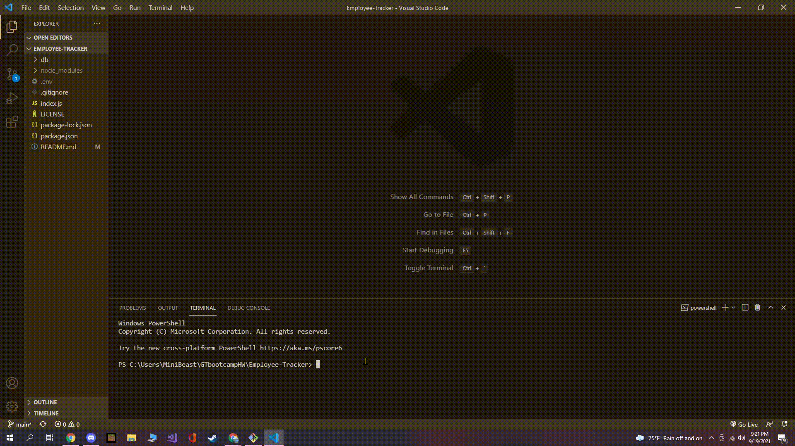

# Employee-Tracker

## Description

A command-line application that allows the user to manage a company's employee database, using Node.js, Inquirer, and MySQL.

## Table of Contents

- [installation](#installation)

- [Usage](#usage)

- [License](#license)

- [Contributing](#contributing)

- [Tests](#tests)

- [Questions](#questions)

## Installation

To install necessary dependencies, run the following command:

---

    npm i

---

For further instructions on getting setup, refer to the gif below:

As shown above, you will need to log into your own mysql account if you want to
initialize the database and seed some initial company data. (PLEASE make sure you are in the db folder when doing this!!!!)

## Usage

Use Node.js command line interface to run application

Please refer to this demo gif:

Too hard to follow? No worries, check the link below to be directed to an mp4 file instead!

EmpTrrackerUsage.mp4

## License

This project is licensed under the MIT license

## Contributing

Best way to contribute is by contacting me or posting issues

## Tests

Run the following command to run tests:

---

    n/a

---

## Questions

If you have any questions about the repo, open an issue or contact me directly at oscar.a.vizcaino@icloud.com. You can find more of my work at
[oscarV42](https://github.com/oscarV42/).
